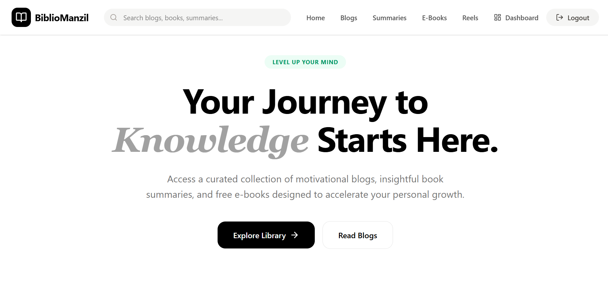
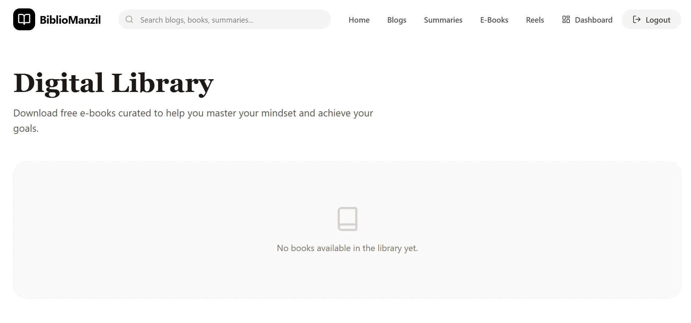
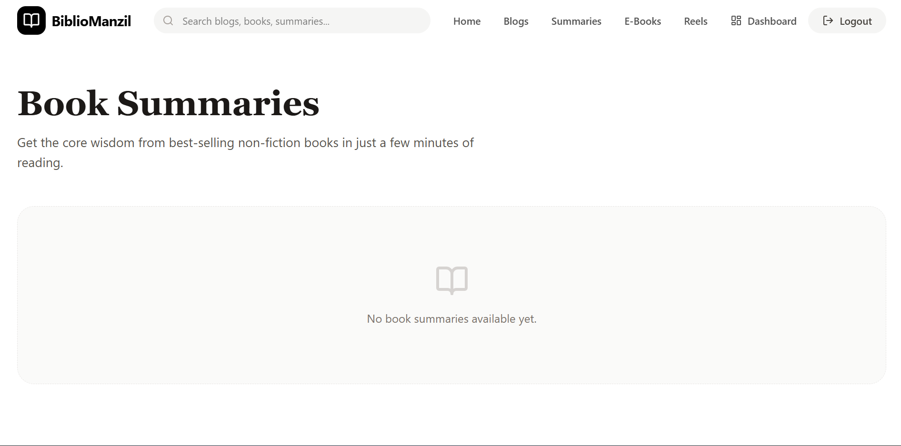
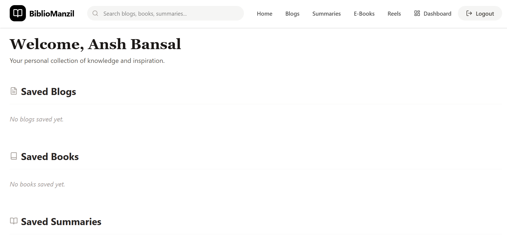
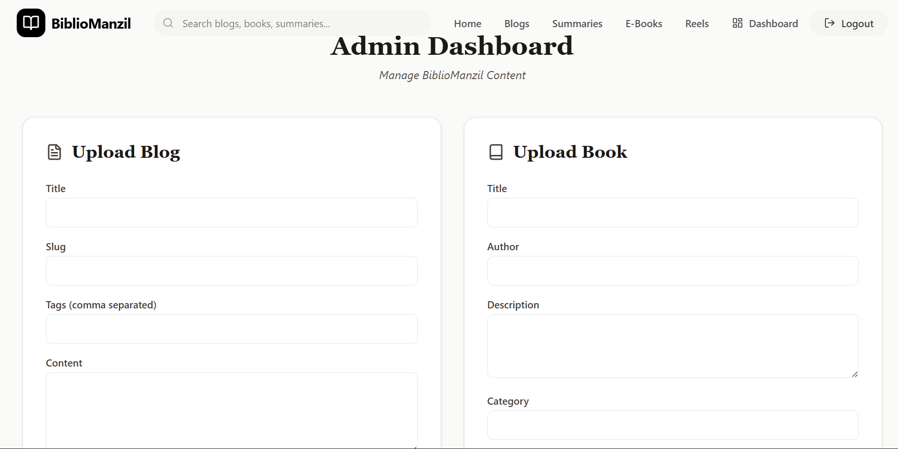

# 📚 BiblioManzil

BiblioManzil is a full-stack web platform designed for readers and learners who enjoy motivational content, book insights, and curated reading resources.

The platform allows users to explore blogs, read book summaries, download free ebooks, watch motivational reels, and bookmark their favorite content for later.

It is built using a modern full-stack architecture with React, Node.js, MongoDB, and Firebase authentication.

---

# 🌐 Live Demo

Frontend  
https://biblio-manzil.vercel.app

Backend API  
https://bibliomanzil.onrender.com

---

# ✨ Features

### 📚 E-Book Library
Browse and download curated motivational and self-development books.

### 📝 Blogs
Read motivational blogs related to productivity, mindset, and personal growth.

### 📖 Book Summaries
Quick and structured summaries of popular books including:
- Key lessons
- Core ideas
- Memorable quotes

### 🎥 Motivation Reels
Watch embedded motivational reels for quick inspiration.

### 🔖 Bookmark System
Users can bookmark:
- Blogs
- Books
- Summaries

Saved items appear in the personal dashboard.

### 👤 Authentication
Secure user authentication using Firebase:
- Email & Password login
- Google Sign-In

### 🛠 Admin Dashboard
Admins can manage platform content by:
- Uploading blogs
- Adding ebooks
- Publishing summaries
- Embedding reels

---

# 🖼 Screenshots

## Homepage

## Book Library

## Book Summary Page

## User Dashboard

## Admin Dashboard

---

# 🏗 System Architecture
Frontend (React + Vite)
↓
Backend API (Node.js + Express)
↓
Database (MongoDB Atlas)
↓
File Storage (Cloudinary)
↓
Authentication (Firebase)

---

# 🧰 Tech Stack

## Frontend
- React
- Vite
- React Router
- TailwindCSS

## Backend
- Node.js
- Express.js
- REST API architecture

## Database
- MongoDB Atlas
- Mongoose

## Cloud Services
- Firebase Authentication
- Cloudinary (File Storage)

## Deployment
- Vercel (Frontend Hosting)
- Render (Backend Hosting)

---

# 📂 Project Structure
bibliomanzil
│
├── src
│ ├── components
│ ├── pages
│ ├── context
│ ├── models
│ └── routes
│
├── server.ts
├── package.json
└── README.md

---

# ⚙️ Environment Variables

Create a `.env` file in the project root with the following variables:
MONGODB_URI=

CLOUDINARY_CLOUD_NAME=
CLOUDINARY_API_KEY=
CLOUDINARY_API_SECRET=

VITE_FIREBASE_API_KEY=
VITE_FIREBASE_AUTH_DOMAIN=
VITE_FIREBASE_PROJECT_ID=
VITE_FIREBASE_STORAGE_BUCKET=
VITE_FIREBASE_MESSAGING_SENDER_ID=
VITE_FIREBASE_APP_ID=

VITE_API_URL=

---

# 🚀 Running the Project Locally

### 1️⃣ Clone the repository
git clone https://github.com/AnshBansalbpl/bibliomanzil.git

### 2️⃣ Navigate into the project
cd bibliomanzil

### 3️⃣ Install dependencies
npm install

### 4️⃣ Start the development server
npm run dev

---

# 📌 Future Improvements

Some potential improvements planned for the platform:

- AI powered book recommendations
- Personalized reading suggestions
- Reading progress tracking
- Community book sharing system
- Advanced search and filtering

---

# 🤝 Contributing

Contributions, issues, and feature suggestions are welcome.

Feel free to open an issue or submit a pull request.

---

# 📜 License

This project is open source and available under the MIT License.

---

# 👨‍💻 Author

Developed by Ansh Bansal

GitHub  
https://github.com/AnshBansalbpl
